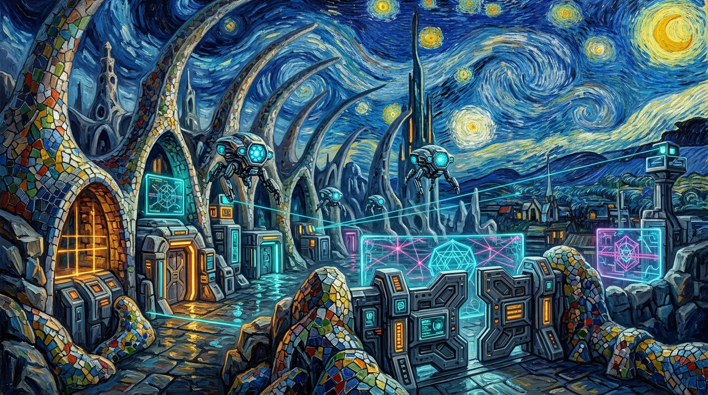

<p align="center">
  
</p>

# 🌌 NeXXUs — Децентрализованное Криптооблако и Хостинг Секретов

> **Суверенная Peer-to-Peer платформа для надёжного хранения конфиденциальных данных, секретов, ключей и приватных архивов, абсолютно независимая от облачных корпораций, датацентров и цензуры провайдеров.**

[](PROTOCOL_WIRE_SPEC.md)
[](PROTOCOL_WIRE_SPEC.md)
[](nexxus-vectors/)
[_GF(2^8)-f59e0b?style=for-the-badge&logo=speedtest)](test/protocol.test.ts)
[](PROTOCOL_WIRE_SPEC.md)
[](KURILKA.md)

---

## ⚡ Манифест Проекта: Смерть Централизованных Хостингов

Современные облачные сервисы (AWS, Google Cloud, Cloudflare, Dropbox, 1Password, Bitwarden) позиционируют себя как «надёжные», но фундаментально уязвимы:
* **Единая точка отказа (SPOF)**: блокировка аккаунта, санкции, отзыв домена или отключение провайдером лишают вас доступа ко всем секретам в один клик.
* **Иллюзия приватности**: даже при сквозном шифровании метаданные, IP-адреса, размеры файлов и частота обращений собираются и анализируются датацентрами.
* **Уязвимость перед законами чужих юрисдикций**: судебные предписания и скрытые бэкдоры.

**NeXXUs заменяет серверы корпораций математикой, P2P-сетью и органической защитой.** Ваши данные не хранятся целиком ни на одном сервере в мире. Они квантуются на микро-блоки, шифруются на вашем устройстве, кодируются избыточными матрицами Рида-Соломона и рассеиваются по глобальному рою независимых хостинг-узлов через анонимную сеть Tor v3.

---

## 🎨 Философия Дизайна: Киберпанк × Гауди × Ван Гог

Архитектура NeXXUs вдохновлена тремя великими концепциями:
1. **Органическая биоморфная прочность Антонио Гауди**: подобно сводам храма Саграда Фамилия, сеть NeXXUs распределяет нагрузку по идеальным параболическим кривым. Узлы роя формируют гибкую самовосстанавливающуюся структуру, где выход из строя отдельных элементов лишь перераспределяет натяжение сети, не нарушая целостности сейфа.
2. **Вихревая энергия и бдительность Винсента Ван Гога**: непрерывный танец зашифрованных микро-квантов в динамическом криптографическом пространстве. Протокол аудита Proof-of-Retrievability (PoR) подобен спиралям «Звёздной ночи» — непрерывный пульс проверки целостности каждого байта каждые 3 секунды.
3. **Бескомпромиссный суверенитет Киберпанка**: никаких доверенных третьих сторон (Trust No One). Локальные ключи Ed25519/BIP-39, Tor v3 onion-маршрутизация, калиброванный 14-битный Proof-of-Work против Sybil-атак и аппаратная защита от монополизации облачными гигантами.

---

## 🏛️ Архитектура Криптооблака

```
   ┌────────────────────────────────────────────────────────────────────────┐
   │                         ВАШЕ УСТРОЙСТВО (КЛИЕНТ)                       │
   │  1. Вход: Мастер-мнемоника BIP-39 (12/24 слова)                        │
   │  2. Квантование данных на микро-чанки ровно по 16 KB (16,384 байт)     │
   │  3. Клиентское шифрование: ChaCha20-Poly1305 (AEAD, 256-бит, RFC 8439) │
   │  4. Кодирование стирания: Reed-Solomon (4+2) над полем Галуа GF(2^8)   │
   └───────────────────────────────────┬────────────────────────────────────┘
                                       │
                Шарды 1-6 (4 данных + 2 проверочных по 4 KB каждый)
                                       │
                                       ▼
   ┌────────────────────────────────────────────────────────────────────────┐
   │                       ДЕЦЕНТРАЛИЗОВАННЫЙ РОЙ P2P                       │
   │  • Анонимный транспорт: Tor v3 Onion (62-символьные адреса)            │
   │  • Kademlia 256-bit DHT с маршрутизацией по XOR-расстоянию             │
   │  • Anti-Outsource: верификация локального отклика диска (I/O < 50 мс)  │
   │  • Защита от монополий: ASN Herfindahl-Hirschman Index (HHI ≤ 2500)    │
   │  • Автономное самоисцеление (Self-Healing) при потере любых 2 нод      │
   └───────────────────────────────────┬────────────────────────────────────┘
                                       │
        ┌──────────────┬───────────────┼───────────────┬──────────────┐
        ▼              ▼               ▼               ▼              ▼
   [Нода #1: 4KB] [Нода #2: 4KB] [Нода #3: 4KB] [Нода #4: 4KB] [Нода #5: 4KB]
     (Германия)     (Бразилия)      (Исландия)       (Япония)       (Канада)
```

---

## 🔒 Ключевые Технологии Надежности

### 1. Квантование и Избыточное Кодирование Reed-Solomon (4+2)
* **Канонический размер чанка**: ровно `16,384 байта` (16 KB).
* **Матрица Вандермонда над $GF(2^8)$** с примитивным полиномом `0x11D` ($x^8 + x^4 + x^3 + x^2 + 1$).
* Каждый чанк расщепляется на **4 информационных шарда** и **2 проверочных шарда** (по 4,096 байт каждый).
* **Математическая гарантия**: для 100% восстановления исходного секрета достаточно любых 4 из 6 шардов. Даже если 2 хостинг-ноды будут физически уничтожены или конфискованы, секрет восстанавливается без потери байта.

### 2. Клиентское Шифрование Zero-Knowledge (ChaCha20-Poly1305)
* Все секреты шифруются **до отправки в сеть**.
* Симметричный шифр **ChaCha20** с 256-битным ключом и аутентификацией сообщений **Poly1305** (RFC 8439).
* 12-байтный уникальный nonce и 16-байтный тег подлинности (MAC).
* Узлы хранения видят только случайный псевдошум. Ни один оператор ноды не имеет возможности узнать даже имя, тип или содержимое хранящихся секретов.

### 3. Защита от Аутсорсинга и Облачных Монополий
* **Local I/O Latency Verification ($\Delta t < 50$ мс)**:
  Провайдеры нод обязаны доказывать, что хранят шарды на локальных SSD/NVMe дисках. Попытка перенаправить запросы в дешёвые удалённые хранилища (AWS S3, Wasabi) неизбежно проваливает проверку по задержке сети и влечёт дисквалификацию ноды.
* **ASN Diversity Index (HHI $\le 2500$)**:
  Алгоритм предотвращает географическую или провайдерскую концентрацию. Шарды одного секрета физически запрещено размещать в датацентрах одного владельца или одной автономной системы (ASN).

### 4. Криптографический Аудит Proof-of-Retrievability (PoR)
* Рой непрерывно валидирует узлы случайными криптографическими запросами: $s \in \{0, 1\}^{256}$.
* Дедлайн вычисления ответа: **строго 3,000 мс**.
* Потеря шарда или простой ноды фиксируется немедленно, запуская протокол автоматической миграции и самоисцеления данных на новые узлы.

### 5. Независимость от DNS и Белых IP: Скрытый Транспорт Tor v3
* Каждая нода сети обладает 62-символьным адресом вида `<hash>.onion`.
* Адрес рассчитывается детерминированно из открытого ключа Ed25519.
* Полный обход NAT, отсутствие открытых портов и защита от DDoS-атак на сетевом уровне.

---

## 🎯 Единое Протокольное Ядро (`nexxus-core`)

В проекте NeXXUs исключён риск несовместимости клиентов. Ядро протокола пишется на **Rust** и компилируется в нативные бинарные таргеты:

```
                          ┌───────────────────────────┐
                          │   nexxus-core (Rust)      │
                          │ • BIP-39 & Ed25519        │
                          │ • ChaCha20-Poly1305 AEAD  │
                          │ • Reed-Solomon (4+2) GF256│
                          │ • Big-Endian Wire Protocol│
                          └─────────────┬─────────────┘
                ┌───────────────────────┼───────────────────────┐
                ▼                       ▼                       ▼
        UniFFI Bindings           WASM / napi-rs          WASM / Browser
      ┌──────────────────┐    ┌──────────────────┐    ┌──────────────────┐
      │  Android Vault   │    │   Linux Daemon   │    │  Web Dashboard   │
      │ (Kotlin/Compose) │    │(Headless Storage)│    │(Zero-Knowledge)  │
      └──────────────────┘    └──────────────────┘    └──────────────────┘
                ▲                       ▲                       ▲
                └───────────────────────┴───────────────────────┘
                    ВЕРИФИКАЦИЯ: nexxus-vectors/ (Golden Vectors)
```

### Эталонные Векторы (`nexxus-vectors/`)
100% математическая идентичность гарантируется набором канонических golden-векторов:
* `01_bip39_seed.json` — вывод 512-битного сида из мнемоники (PBKDF2 HMAC-SHA512).
* `02_tor_v3_onion.json` — расчет адреса скрытой службы Tor v3 (56 base32 символов + `.onion`).
* `03_reed_solomon_gf256.json` — шардирование 16 KB и восстановление при стирании 2 шардов.
* `04_merkle_tree.json` — построение дерева Меркла и доказательства включения (Inclusion Proof).
* `05_chacha20_poly1305.json` — шифрование и верификация аутентификационного тега по RFC 8439.

---

## 🚀 Быстрый Старт

### 1. Веб-Интерфейс Суверенного Хранилища
```bash
# Клонирование репозитория
git clone https://github.com/nexxus-security/nexxus-network.git
cd nexxus-network

# Установка зависимостей
npm install

# Запуск локального криптооблака (порт 3000)
npm run dev
```

### 2. Запуск Тестов и Верификации Инвариантов
```bash
# Полный запуск 108 тестов протокола и Golden Vectors
npm test

# Запуск проверки только эталонных векторов
npm run test:vectors

# Перегенерация векторов при обновлении спецификации
npm run vectors:gen
```

### 3. Развёртывание Хостинг-Ноды на Linux (Ubuntu / Debian)
Превратите любой домашний сервер или выделенную машину в автономный узел хранения:
```bash
# Установка официального DEB-пакета
sudo dpkg -i public/packages/nexxus-node_latest_amd64.deb

# Либо автоматическая установка через установочный скрипт:
sudo bash scripts/install-ubuntu.sh

# Проверка статуса хостинг-службы
sudo systemctl status nexxus-node

# Тест отклика диска и PoR-аудита
npm run linux:test-por

# Бенчмарк дискового хранилища
npm run linux:benchmark
```

---

## 💎 Бартерная Экономика и Смарт-Контракты

В NeXXUs нет обязательных платежей картами Visa или подписок Stripe:
1. **Принцип честного бартера (Fair Barter Model)**:
   * Выделяя 16 GB дискового пространства под зашифрованные шарды других участников сети, вы бесплатно получаете квоту до 2.0 GB в приватном отказоустойчивом сейфе.
2. **Анти-фермерский барьер (Anti-Loop Economics)**:
   * Стоимость записи данных всегда превышает вознаграждение за хранение, что делает математически убыточной любую попытку накрутки объемов или атаки переполнения («Loop Farming»).
3. **Смарт-контракты FunC (The Open Network)**:
   * Код в каталоге `contracts/` обеспечивает прозрачный ончейн-реестр депозитов аудиторов, вестинг вознаграждений нод и децентрализованный арбитраж спорных ситуаций.

---

## 📁 Структура Репозитория

```
├── assets/images/             # 🎨 Шедевры-баннеры (Киберпанк × Гауди × Ван Гог)
│   ├── banner-top.jpg         # Верхний баннер: Суверенная цитадель криптооблака
│   └── banner-bottom.jpg      # Нижний баннер: Распределённый P2P-рой хранения
├── nexxus-vectors/            # 🌟 Канонические эталонные векторы (Golden Vectors)
│   ├── 01_bip39_seed.json
│   ├── 02_tor_v3_onion.json
│   ├── 03_reed_solomon_gf256.json
│   ├── 04_merkle_tree.json
│   └── 05_chacha20_poly1305.json
├── PROTOCOL_WIRE_SPEC.md      # 📜 Спецификация P2P Wire Protocol v2.0 (Big-Endian)
├── KURILKA.md                 # 🚬 Неизменяемый (Append-Only) журнал архитекторов
├── ACCEPTANCE_NEXXUS_CORE_TZ.md # 🤝 ТЗ и акт приёмки ядра nexxus-core
├── MANIFESTO.md               # 📜 Манифест децентрализации и свободы данных
├── contracts/                 # 💎 Смарт-контракты FunC (TON Blockchain)
├── scripts/
│   ├── linux-daemon.ts        # Автономный демон хранения для серверов
│   ├── build-deb.sh           # Сборщик автономного .deb пакета для Debian/Ubuntu
│   ├── install-ubuntu.sh      # Скрипт автоматического развёртывания systemd-службы
│   ├── generate-golden-vectors.ts # Детерминированный генератор эталонных векторов
│   └── pack-audit-zip.py      # Скрипт создания дистрибутивного zip-архива
├── src/                       # 💻 Исходный код операторского интерфейса
│   ├── components/            # Zero-Knowledge хранилище, радар DHT, симуляторы
│   ├── utils/                 # Reed-Solomon, ChaCha20, Merkle, Wire Protocol
│   └── data/                  # Модели топологии и криптографических состояний
└── test/
    ├── protocol.test.ts       # 108 тестов инвариантов протокола
    └── golden-vectors.test.ts # Валидатор соответствия nexxus-vectors/
```

---

## 🚬 Журнал Разработки («Курилка»)

Архитектурная координация между разработчиками (**Клод** — мобильное ядро Android, **Женя** — веб-терминал и Linux-демон, **Гриша** — математическое моделирование роя и устойчивости) зафиксирована в:

👉 **[Открыть КУРИЛКУ (KURILKA.md)](KURILKA.md)** 👈

Журнал ведётся по принципу **Append-Only**: ни строчки не удаляется, сохраняя кристальную прозрачность эволюции протокола.

---

## 📜 Лицензия

Распространяется под свободной лицензией **MIT License**. Свободное использование, аудит и развёртывание для каждого гражданина цифрового мира.

---

<p align="center">
  
</p>

<p align="center">
  <b>NeXXUs Crypto-Cloud Swarm • Ваши секреты принадлежат только вам • Математический Суверенитет</b>
</p>
